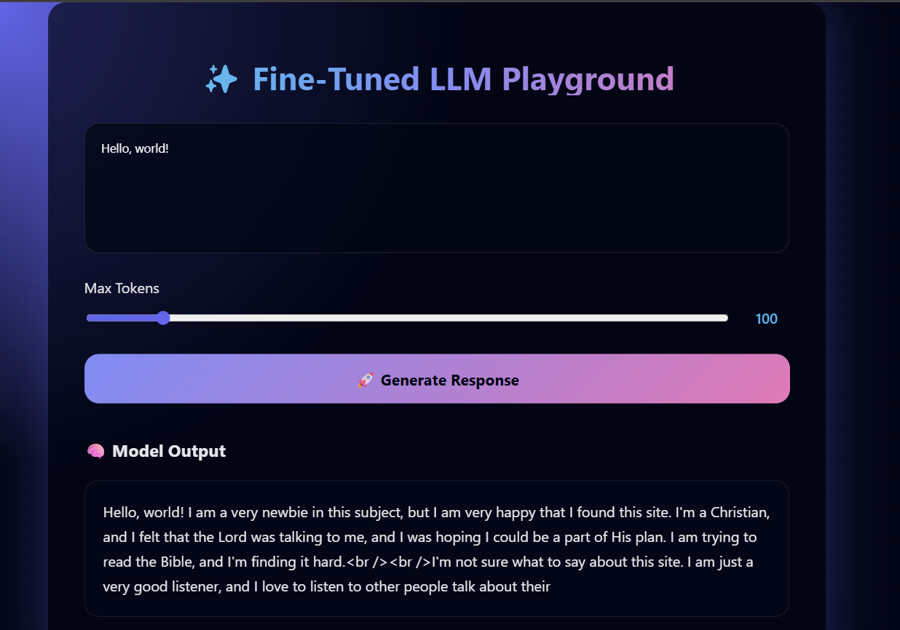

# 🚀 Fine-Tuned LLM Playground

A full-stack application designed to interact seamlessly with a fine-tuned Hugging Face Large Language Model (LLM). This robust project features a high-performance **FastAPI backend** for scalable ML model inference, paired with a stunning, glassmorphism-inspired **React + Vite frontend**.

## 📸 UI Demonstration

*(Replace this placeholder with the actual image path you provided, e.g., `screenshots/image.png`)*


---

## 🏗️ Architecture & Stack

### 1. Backend (`app/`)
- **Framework:** FastAPI (High-performance, async API)
- **Machine Learning Core:** `transformers`, `torch`, `accelerate`
- **Default Model:** `PrashantKumarSingh/my-finetuned-model` (Configured to run safely on CPU)
- **Features:** 
  - Dynamic token generation `/generate`
  - Health checks `/`
  - Built-in CORS configurations to allow frontend connections natively.

### 2. Frontend (`ui/`)
- **Framework:** React + Vite (Lightning-fast HMR and building)
- **Styling:** Pure CSS utilizing advanced dynamic backgrounds and glassmorphism techniques.
- **Features:**
  - Token control slider.
  - Interactive loader and error handling.
  - Code-block outputs for clean reading of model returns.

---

## � Local Development (Getting Started)

Follow these steps to run the application directly on your local machine for development or testing.

### Prerequisites
- Node.js & npm (for the frontend)
- Python 3.10+ (for the backend)
- A **Hugging Face Token** (if your model requires authentication).

### Step 1: Initialize the Backend (FastAPI)

1. Open a terminal at the root of the project.
2. Create and activate a virtual environment (Recommended):
   ```bash
   python -m venv .venv
   
   # Windows:
   .venv\Scripts\activate
   
   # Mac/Linux:
   source .venv/bin/activate
   ```
3. Install the required Python dependencies:
   ```bash
   pip install -r requirements.txt
   ```
4. Export your Hugging Face Token as an environment variable and start the API:
   ```bash
   # Windows (PowerShell):
   $env:HF_TOKEN = "your_hf_token_here"
   uvicorn app.main:app --host 0.0.0.0 --port 8000 --reload
   
   # Mac/Linux:
   export HF_TOKEN="your_hf_token_here"
   uvicorn app.main:app --host 0.0.0.0 --port 8000 --reload
   ```
> **Backend is now live at:** `http://localhost:8000`
> **Swagger UI Docs:** `http://localhost:8000/docs`

### Step 2: Initialize the Frontend (React)

1. Open a **new** terminal window and navigate into the `ui` directory:
   ```bash
   cd ui
   ```
2. Install the necessary node modules:
   ```bash
   npm install
   ```
3. Boot up the Vite developer server:
   ```bash
   npm run dev
   ```
> **Frontend is now live at:** `http://localhost:5173`

*(Note: The `App.jsx` file is currently configured to send requests to `http://82.25.104.12:8000/generate`. If you are running the backend locally, you may need to temporarily alter this URL in `App.jsx` to `http://localhost:8000/generate`)*.

---

## 🐳 Docker Deployment (Production-Ready)

Docker is the best way to deploy this full-stack application reliably. The codebase is equipped with individual Dockerfiles for both the backend and frontend, as well as an orchestrated `docker-compose.yml`.

### Option A: The "One-Click" Docker Compose Deployment (Recommended)

1. Make sure Docker Desktop is running on your machine.
2. Ensure the newly created `docker-compose.yml` file is in your root directory.
3. Pass your HF token and spin up both containers simultaneously from the root directory:

**Windows (PowerShell):**
```bash
$env:HF_TOKEN="your_token_here"; docker-compose up --build -d
```
**Mac/Linux:**
```bash
HF_TOKEN="your_token_here" docker-compose up --build -d
```

Your API is now on port `8000` and your React frontend is being served via Nginx on standard HTTP port `80` (accessible at `http://localhost`).

### Option B: Deploying Containers Independently

If you want to host the backend and frontend on completely separate machines or cloud services, build them individually:

**1. The Backend API:**
```bash
# Build the image from the root directory
docker build -t llm-backend-api .

# Run the container (Map internal 8000 to external 8000)
docker run -p 8000:8000 -e HF_TOKEN="your_token_here" llm-backend-api
```

**2. The Frontend UI:**
```bash
# Navigate to the UI folder
cd ui

# Build the Nginx frontend image
docker build -t llm-frontend-ui .

# Run the container (Map internal Nginx 80 to external 80)
docker run -p 80:80 llm-frontend-ui
```

---

## ☁️ Cloud Deployment Strategies

If you are looking to take this application to the public web, here are the recommended approaches:

### Deploying the Backend
Since this API runs a Hugging Face LLM using PyTorch, it requires decent machine resources.
- **Render / Railway / Fly.io:** Great for deploying Dockerized Python services. You can deploy the backend by simply connecting your GitHub repo and selecting the root `Dockerfile`. Set `HF_TOKEN` in their dashboard environment variables.
- **AWS EC2 / DigitalOcean Droplet:** Clone the repo onto a blank VM, install Docker Engine, and run the `docker-compose up -d` command detailed above.

### Deploying the Frontend
Since the frontend is a static React application, it is free and effortless to host globally.
- **Vercel / Netlify / Cloudflare Pages:** Connect your GitHub repo, set the Root Directory to `ui`, the Build Command to `npm run build`, and the Output Directory to `dist`.
- *(Don't forget to update the fetch URL in `App.jsx` to point to the secure `https://` domain of your deployed backend before pushing!)*

---

## 🔌 API Reference Schemas

### 🟢 `GET /` (Health Check)
Monitors if the API is active and which ML model is currently loaded.
**Response:**
```json
{
  "status": "running",
  "model": "PrashantKumarSingh/my-finetuned-model"
}
```

### 🧠 `POST /generate` (AI Inference)
Generates tokens based on a provided prompt string.
**Body:**
```json
{
  "prompt": "Explain Quantum Mechanics to a 5 year old.",
  "max_tokens": 100
}
```
**Response:**
```json
{
  "prompt": "Explain Quantum Mechanics to a 5 year old.",
  "response": "Imagine you have a magical toy box..."
}
```
